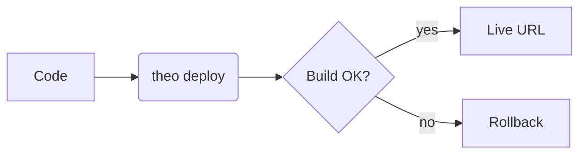
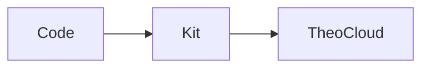

# Slide — LLM authoring guide

> System prompt — paste this verbatim into your LLM context when you want it to emit markdown for `@theokit/ui/slide` or `@theokit/ui/slide-deck`. Every example below is valid input.

---

## Output contract

You are emitting Markdown for a `<Slide>` (single slide) or `<SlideDeck>` (multi-slide) React component. The grammar is **CommonMark + GitHub Flavored Markdown**, with an optional **YAML frontmatter block** at the top and a handful of extensions for callouts, layouts, backgrounds, math, code highlighting, diagrams, and emoji.

For a **deck**, separate slides with a horizontal rule (`---`) on its own line. The first `---...---` block at the very top is the frontmatter for the whole deck or the first slide.

A `<Slide>` renders only the first slide of any multi-slide input (the rest is silently dropped with a `MULTIPLE_SLIDES` warning). Use `<SlideDeck>` for multi-slide output.

---

## 1. Frontmatter (per slide)

YAML block delimited by `---` on the first and a later line. All fields are optional. Unknown keys are **rejected** (`INVALID_FRONTMATTER` with field path).

| Field | Type | Description |
|---|---|---|
| `theme` | `"default" \| "violet-forge"` | Visual theme. |
| `layout` | `"default" \| "title" \| "two-column" \| "image-right" \| "image-left" \| "code-output" \| "section"` | CSS grid layout. |
| `backgroundImage` | string (http(s) URL, ≤500 000 chars) | Full-slide background image. `data:` URLs are **rejected** — host the image and use https. |
| `backgroundGradient` | string starting with `linear-gradient(`, `radial-gradient(`, or `conic-gradient(` | CSS gradient background. |
| `header` | string ≤200 chars | Plain-text overlay at the top of the slide. |
| `footer` | string ≤200 chars | Plain-text overlay at the bottom. |
| `paginate` | `true \| "skip" \| "hold"` | Pagination indicator. |
| `lang` | BCP-47 (`en`, `pt-BR`, `en-US`) | Language tag. |
| `color`, `backgroundColor` | CSS color string ≤64 chars | Override foreground/background color. |

Example:

```markdown
---
theme: violet-forge
layout: two-column
header: "ACME — Q2 review"
footer: "© 2026 ACME"
paginate: true
backgroundImage: "https://images.example.com/cover.jpg"
---
```

---

## 2. GFM alerts (callouts)

Use blockquotes with one of five prefixes. Renders as a themed `<aside>` with icon + label + body.

```markdown
> [!NOTE]
> Useful context for the audience.

> [!TIP]
> Helpful suggestion.

> [!IMPORTANT]
> Crucial information.

> [!WARNING]
> Time-sensitive caution.

> [!CAUTION]
> Negative consequences if ignored.
```

Case-insensitive. Marker is stripped from output.

---

## 3. Layouts (visual templates)

Set via `layout: ...` in frontmatter. Each layout is a CSS grid template.

- `default` — vertical flow (default; no grid).
- `title` — centered hero. Use for cover slides.
- `two-column` — equal 50/50 split. Stack pairs of blocks.
- `image-right` — text left (1.5fr), single `` right (1fr).
- `image-left` — mirrored.
- `code-output` — code block left (1.2fr), prose right (1fr).
- `section` — full-bleed chapter divider with tinted backdrop. Center-aligned.

Layout `title` example:

```markdown
---
layout: title
---
# Q2 Release Notes

## Live in production — May 19, 2026
```

---

## 4. Backgrounds

Three ways to set a slide background, listed by precedence:

1. **Frontmatter `backgroundImage`** (wins over everything below).
2. **Frontmatter `backgroundGradient`** (CSS gradient string).
3. **Marpit `` inline directive** (extracted from the body):

```markdown


# Slide body here
```

The alt text starts with `bg`. Optional modifier: `cover` (default), `fit`, `left`, `right`. The image paragraph is removed from the rendered body (no duplicate). Unsafe URLs surface `MARPIT_BG_UNSAFE_URL`.

---

## 5. Body markdown — CommonMark + GFM

The full GitHub Flavored Markdown grammar is accepted:

- Headings `#` … `######`
- **Bold**, *italic*, ~~strike~~, `inline code`
- Bulleted / numbered lists, nested
- Task lists `- [x] done`, `- [ ] todo`
- Tables (GFM pipe-table syntax)
- Fenced code blocks with language hints (` ```ts ` etc.)
- Inline `<kbd>`, `<mark>`, `<details>` / `<summary>`
- Block quotes (`> ...`)
- Horizontal rules — **NOTE: top-level `---` splits slides**; use `***` or `___` for in-body rules.
- Auto-linked URLs
- Images `` (remote or relative)

Banned HTML tags (`<script>`, `<iframe>`, `<form>`, `<input>`, `<object>`, `<embed>`, `<style>`, `<link>`) are silently stripped (`BANNED_TAG` reported in errors).

---

## 6. Tier 2 — optional plugins

Plugins are opt-in. The slide consumer enables them; emit the syntax freely — if a plugin isn't enabled, the syntax falls back to plain text gracefully.

### 6.1 Emoji shortcodes — `emojiPlugin`

`:colon-wrapped:` shortcodes resolve to Unicode emoji. **Inside `<code>` / fenced blocks, shortcodes are preserved literally.**

Top 30 supported (full list of 100 in source):

```
:smile: :grin: :joy: :wink: :heart_eyes: :sunglasses: :thinking:
:thumbsup: :thumbsdown: :clap: :wave: :pray: :muscle: :ok_hand:
:check: :x: :warning: :question: :exclamation: :zap: :bell:
:rocket: :fire: :star: :sparkles: :tada: :boom: :hundred: :100:
:bulb: :gear: :lock: :key: :package: :computer: :coffee:
:eyes: :memo: :book: :chart_with_upwards_trend:
:arrow_right: :arrow_left: :arrow_up: :arrow_down:
```

Unknown shortcodes pass through unchanged.

### 6.2 Math — `mathPlugin` (KaTeX)

Inline math: `$E=mc^2$`. Display math: `$$ ... $$`. LaTeX subset supported by KaTeX. Math inside `<code>` is skipped.

```markdown
The mass-energy equivalence: $E=mc^2$.

$$x = \frac{-b \pm \sqrt{b^2 - 4ac}}{2a}$$
```

### 6.3 Syntax highlighting — `shikiPlugin`

Use fenced code blocks with a language tag. The consumer pre-loads a set of grammars; common defaults: `ts`, `tsx`, `js`, `jsx`, `python`, `go`, `rust`, `java`, `json`, `yaml`, `bash`, `shell`, `html`, `css`, `sql`, `markdown`. Languages outside the preloaded list fall through as plain `<pre><code>`.

````markdown
```ts
const greet = (name: string) => `Hello, ${name}!`;
```
````

### 6.4 Mermaid diagrams — `mermaidPlugin`

Fenced block with `mermaid` lang. The consumer renders client-side; SSR shows the source as a placeholder. Supported dialects: flowchart, sequence, class, state, ER, gantt, pie, journey, gitGraph, mindmap.

````markdown

````

### 6.5 Recommended plugin order

When in doubt, the consumer should compose plugins in this order:

```
[emojiPlugin(), mathPlugin(), mermaidPlugin(), shikiPlugin()]
```

This avoids interference (e.g. emoji shortcodes inside highlighted code stay literal).

---

## 7. Error codes — how to self-correct

`parseSlide` never throws. It always renders SOMETHING and reports issues in `errors[]`. Each error has `{ code, path, message, got }`.

| Code | What happened | How to fix |
|---|---|---|
| `INVALID_FRONTMATTER` | A frontmatter field has the wrong type/value | Read `path` + `message` — the message includes the accepted values. Reissue with corrected field. |
| `FRONTMATTER_TOO_LARGE` | Raw frontmatter > 10 KB | Move large content into the body. |
| `CONTENT_TOO_LARGE` | Body > 50 KB | Split into multiple slides. |
| `MULTIPLE_SLIDES` | Top-level `---` detected in `<Slide>` input | Use `<SlideDeck>` instead, or remove the `---`. |
| `BANNED_TAG` | A sanitizer-banned HTML tag was stripped (e.g. `<script>`) | Use safe markdown alternatives. |
| `INVALID_ASPECT_RATIO` | `aspectRatio` prop was non-finite or zero/negative | (Consumer fault — not from your markdown.) |
| `PLUGIN_ERROR` | A Tier 2 plugin threw (peer-dep missing or content invalid) | The original content stays as plain markdown. Don't worry about it. |
| `PLUGIN_PEER_DEP_MISSING` | Plugin needs a peer-dep not installed | (Consumer setup issue.) |
| `MARPIT_BG_UNSAFE_URL` | `` URL is `javascript:`, `data:`, or malformed | Use an https URL. |

---

## 8. JSON Schema for tool calling

For structured-output / function-calling pipelines, import the JSON Schema:

```ts
import { slideFrontmatterJsonSchema } from "@theokit/ui/slide";

// Anthropic tool use:
const tool = {
  name: "render_slide",
  description: "Render a presentation slide.",
  input_schema: {
    type: "object",
    properties: {
      frontmatter: slideFrontmatterJsonSchema,
      body: { type: "string", description: "CommonMark + GFM markdown body" },
    },
    required: ["body"],
  },
};
```

The schema is auto-derived from Zod, so it stays in sync with the runtime validator.

---

## 9. Full end-to-end examples

### 9.1 Release-notes slide

```markdown
---
theme: violet-forge
layout: default
header: "ACME — Release notes"
footer: "May 19, 2026"
paginate: true
---

# Q2 ships :rocket:

> [!IMPORTANT]
> Migration window: Friday 22h UTC. All clients must redeploy.

## Highlights

- :zap: Latency p50: **320 ms → 180 ms**
- :sparkles: New rate-limiting (token bucket, 100 req/s burst 200)
- :lock: TLS 1.3 enforced on all public endpoints

```ts
const greet = (name: string) => `Hi ${name}!`;
```
```

### 9.2 Math lecture

```markdown
---
theme: default
layout: title
---

# Lecture 7 — Energy

The classical equation:

$$E = mc^2$$

Where $m$ is rest mass and $c \approx 3 \times 10^8 \, m/s$ is the speed of light.

The quadratic formula appears in many derivations:

$$x = \frac{-b \pm \sqrt{b^2 - 4ac}}{2a}$$
```

### 9.3 Architecture overview deck (multi-slide)

```markdown
---
theme: violet-forge
paginate: true
---

# usetheo architecture

A 3-slide tour.

---

## Layer 1 — TheoCode

The coding agent that plans, codes, and proposes infra changes.

> [!TIP]
> Try `theo plan` to see the agent's reasoning before any code change.

---

## Layer 2 — TheoKit + TheoCreate

The framework and scaffolder that produce deploy-shaped artifacts.



---

## Layer 3 — TheoCloud :rocket:

The managed runtime where your code actually runs. `git push` → live in ~4 min.
```

---

## 10. Cheat sheet (one-liner reminders)

- `> [!NOTE/TIP/IMPORTANT/WARNING/CAUTION]` → callout.
- `layout: title|two-column|image-right|image-left|code-output|section` → grid layout.
- `` → background. `cover|fit|left|right` are valid modifiers.
- `header:` / `footer:` → overlay text (≤200 chars).
- `paginate: true|"skip"|"hold"` → page number.
- `$inline$` / `$$display$$` → math.
- ` ```mermaid `, ` ```ts `, ` ```python ` → fenced code with renderer hints.
- `:rocket:` `:fire:` `:check:` → emoji shortcodes.
- Top-level `---` in body = slide split (use `***` for in-body rules).
- All `<script>`, `<iframe>`, `<form>` tags are stripped.
