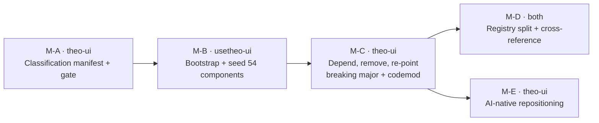

# What the pivot was

Narrow `@theokit/ui` to an **AI-exclusive** component library, and extract the non-AI
surface — generic shadcn-like primitives, the shared Violet Forge foundation, and the
cloud/PaaS components — into a separately published **`@usetheo/ui`** repository.
`@theokit/ui` then depends on `@usetheo/ui`. For consumers this is a **breaking major plus a
codemod**.

Completed 2026-07-03, shipped as `@theokit/ui@1.0.0`.

# Locked decisions

| Decision | Value |
| --- | --- |
| Structure | A separate published repository, not a monorepo |
| Migration | Breaking major plus a codemod |
| Scope | All 54 non-AI components at once (42 generic + 12 cloud-ops) |
| `@usetheo/ui` identity | Carries the Violet Forge design system — foundation plus primitives; `@theokit/ui` depends on it |
| Move mechanism | Copy source and adapt imports — no `git-filter` |
| Tooling | A full quality-gate mirror in the new repo, minus the AI-engine dogfood and classify checks |
| Publish | npm, ESM-only, Apache-2.0, with a gh-pages registry |
| **Boundary rule** | **"AI-agent surface vocabulary" (coding-agent + chat), not structure** |

The boundary rule is the one that mattered. Classifying by *vocabulary* rather than by
folder structure is what let a mechanical gate (`pnpm classify:check`) enforce the split.
Every component directory is tagged `ai` / `generic` / `cloud-ops` in
`registry/component-classification.json`, and drift fails the build.

# Release policy

Commit locally per milestone; cut a release **only when the entire roadmap is complete**.
No per-milestone release.

The reasoning: M-A through M-D were internal groundwork with no standalone consumer value.
The breaking major and the repositioning are the consumer-facing event, and they should
arrive together rather than as four separate disruptions.

# Milestones

| ID | Outcome |
| --- | --- |
| **M-A** | 82 `ai` / 54 non-AI classified, 3 disputed cases resolved from component evidence. Gate wired into `quality:gates`. 16 tests, 93% coverage. |
| **M-B** | `@usetheo/ui` stood up: 39 primitives + 15 composites + the Violet Forge foundation, mirrored toolchain, **664 tests**, 170 KB ESM build, **0 AI leakage** verified. |
| **M-C** | `@theokit/ui` consumes `@usetheo/ui`; 54 components removed; imports re-pointed; **1400 tests**, bundle **−40%**. |
| **M-D** | Two cross-referenced registries. All 15 cross-package `registryDependencies` URLs resolve `200`. |
| **M-E** | Narrative repositioning. Component count corrected 153 → **99** (gate-authoritative). Moved components appear only as pointers; `package.json` exports **zero** moved slugs, proven programmatically. |

# The narrative change

M-E required a strategic review to weaken a locked narrative anchor. The former co-equal
wedge — "built for AI agents **and cloud dashboards**" — was retired. The wedge is now
**"Built for AI-agent surfaces (coding agents + chat)"**, and the cloud-ops layer lives in
`@usetheo/ui`.

This is recorded rather than silently rewritten because the prior wording was a locked
decision. Changing a locked name or narrative requires an explicit review, and this was one.

# Publishing, and what it cost

A name conflict surfaced at publish time: `@usetheo/ui` already existed on npm with a
different 136-component line. Investigation via the npm downloads API and dist-tags
confirmed the project owner was the **sole consumer** — roughly 463 downloads/month were all
their own installs. Reusing the name was therefore safe, and the line continued.

Sequence: `@usetheo/ui@0.14.0` published first; then `@theokit/ui` swapped its dependency
from `file:../usetheo-ui` to `^0.14.0`, which also resolved a deferred `publint` failure;
then `@theokit/ui@1.0.0` published. A fresh `npm install @theokit/ui@1.0.0` in a clean
directory resolves both packages with zero vulnerabilities.

# Honest divergences recorded at the time

- **npm `1.0.0` ≠ git tag `v1.0.0` exactly.** The tag predates the release-time dependency
  swap; npm was published from `develop` HEAD. Reconciled afterwards via a follow-up PR.
- **Published with `--no-provenance`**, locally. `publishConfig.provenance: true` remains
  set for the eventual CI-based publish path.
- **A token pasted into a chat was used and then removed from `~/.npmrc`**, but remained
  exposed in conversation history and was flagged for rotation.

The third item is why it is recorded here. A release note that lists only what went right is
not a release note.

# What the pivot leaves behind

Two scopes, deliberately. `@theokit/*` is the AI-native product; `@usetheo/*` is the
neutral, community-facing generic layer. Folding the second into the first was considered
and **rejected** — the split signals neutrality, and renaming a published package is costly
churn with no consumer benefit at current adoption. Revisit only if the strategy becomes a
single unified brand.
