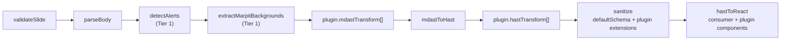

| Field | Value |
| --- | --- |
| Author | paulohenriquevn |
| Date | 2026-05-19 |
| Status | **Implemented** (2026-05-19) |
| Depends on | [RFC 0002](/rfcs/0002-slide.md), [RFC 0003](/rfcs/0003-slide-deck.md) |

# Motivation

The 2026-05-19 visual review confirmed the Slide primitive rendered CommonMark and GFM
correctly, but the result felt one-dimensional — "just text and tables". LLMs trained on
Marp, Reveal.js, and GitHub docs emit alerts, math, syntax-highlighted code, mermaid
diagrams, and Marpit backgrounds **naturally**. Without support, the agent surface looks
underpowered next to PowerPoint or Keynote.

The split: **Tier 1** ships the highest-impact additions with zero new peer-deps. **Tier 2**
adds the heavy engines (Shiki, KaTeX, Mermaid) opt-in, so the baseline slide bundle stays
small.

# Plugin architecture

```ts
interface SlidePlugin {
  name: string;
  mdastTransform?: (tree: MdastRoot) => Promise<MdastRoot> | MdastRoot;
  hastTransform?: (tree: HastRoot) => Promise<HastRoot> | HastRoot;
  components?: Record<string, FC<unknown>>;
  sanitizeSchemaExtension?: { tagNames?: string[]; attributes?: Record<string, string[]> };
}
```

Pipeline order:



## Two invariants that make the plugin surface safe

**D16 — Error isolation.** Every plugin call is wrapped in `try/catch`. Throws are
collected into `errors[]` with `code: "PLUGIN_ERROR"`. **The pipeline never throws.** A
broken plugin degrades that content to plain markdown; it does not take down the slide.

**D17 — Sanitize-schema merge.** A plugin emitting non-default tags (Shiki spans, KaTeX
MathML, Mermaid SVG) **must** declare `sanitizeSchemaExtension`. Without it the sanitizer
silently strips its output. `getSlideSanitizeSchema(extensions)` merges plugin extensions
on top of the baseline.

Note where sanitize sits in the pipeline: **after** every plugin transform. A plugin cannot
bypass it — it can only widen the allow-list explicitly, which is auditable. The rejected
alternative was auto-mirroring whatever a plugin emits, which is a sanitize bypass wearing
a helpful face.

# Tier 1 — baked in, zero new peer-deps

| Feature | Surface | Mechanism |
| --- | --- | --- |
| GFM alerts | `> [!NOTE]` blockquote | `detectAlerts` walks mdast blockquotes → `<aside class="theo-slide-alert">` with a type attribute. Five types: note, tip, important, warning, caution. |
| Layouts | Frontmatter `layout:` | Applied as `data-theo-slide-layout` on the outer `<section>`. Seven CSS grid templates. |
| Background image | Frontmatter `backgroundImage:` | Validated by `sanitizeBgUrl` — **http/https only, `data:` URLs rejected** (EC-7). Capped at 500,000 chars. |
| Background gradient | Frontmatter `backgroundGradient:` | Prefix regex (`linear-`/`radial-`/`conic-gradient(`). |
| Marpit `` | Markdown body | `extractMarpitBackgrounds` drops the paragraph from the tree and exposes `ParsedSlide.extractedBackground`. Unsafe URLs surface `MARPIT_BG_UNSAFE_URL`. Precedence: `frontmatter.backgroundImage` > `extractedBackground.url` (D18). |
| Header / footer / paginate | Frontmatter | Plain text ≤ 200 chars, rendered as absolutely-positioned overlays. |

`data:` URLs are rejected for backgrounds specifically to prevent DoS through massive
base64 payloads inflating every slide's markdown. The consumer hosts images externally.

# Tier 2 — opt-in plugins

Each is its own sub-subpath with externalized peer-deps.

| Plugin | Peer-deps | Key invariants |
| --- | --- | --- |
| `shikiPlugin({ themes, langs })` | `shiki` | Highlighter cached as a singleton. Unknown languages pass through as plain `<pre><code>`. Sanitize extension allows `<span>` with `style`/`className`. Bundle scales linearly with `langs` — ~50 KB at 5, ~200 KB at 30. |
| `mathPlugin({ katexOptions })` | `katex`, `hast-util-from-html`, `unist-util-visit` | Skips matches inside `<code>`/`<pre>` so `$amount` in code never renders as math. Block math resolves before inline, masking overlapping ranges. Sanitize extension lists 30+ MathML tags. Consumer must import `katex/dist/katex.min.css`. |
| `mermaidPlugin({ theme })` | `mermaid` | Client-only — mermaid measures the DOM. SSR shows source as a `<pre>` placeholder with `role="img"`. Error fallback shows the source so PDF print stays readable. Sanitize extension lists 30+ SVG tags. |
| `emojiPlugin({ extra })` | none | Skips matches inside `<code>`/`<pre>` via an ancestor check. 100 baseline emojis. Unknown shortcodes pass through unchanged. |

## Recommended order

```ts
[emojiPlugin(), mathPlugin(), mermaidPlugin(), shikiPlugin()]
```

Order is array index. `[shiki, emoji]` would emoji-substitute tokens inside highlighted
code; the ancestor check handles the common case, but the order above avoids the class of
problem entirely.

# Trade-offs accepted

- **Explicit opt-in over auto-detect** (D1): two extra import lines per consumer, in
  exchange for a deterministic bundle and zero magic.
- **Sanitize-schema sync burden** (D17): each plugin keeps its allow-list current with the
  library it wraps. A new KaTeX release adding `<mphantom>` means updating the extension.
  Accepted over the alternative, which is a bypass.
- **Marpit background lives in `ParsedSlide.extractedBackground`, not `frontmatter`**
  (D18): preserves the "frontmatter is immutable post-validate" invariant. The component
  reads from two sources with documented precedence.
- **Mermaid renders client-only**: SSR and print both fall back to source code.

# Risk accepted

The `<theo-mermaid>` custom element is sanitize-whitelisted, so a consumer writing a
literal `<theo-mermaid>` in markdown bypasses code-block detection. `defaultSchema` already
strips raw HTML elements outside the allow-list, but a future plugin extending in a
conflicting way turns this into a coordination problem. A namespaced custom element via the
web-component registry is the follow-up.

# Test coverage

128 new and extended tests, stacked on 95 from RFC 0002 and 160 from RFC 0003. Bundle
isolation invariant preserved — the barrel is unchanged.

Usage reference: [`/engines/slide-plugins.md`](/engines/slide-plugins.md).
