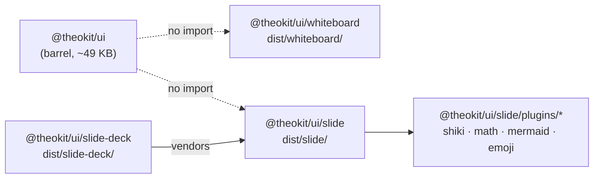

# The pattern

An **engine** is a component whose algorithmic core comes from a mature upstream library
(a markdown parser, a hand-drawn renderer, a graph layout engine). Engines are heavy
enough that including them in the barrel would blow the bundle budget for every consumer,
including the ones who never import them.

The rule: an engine ships under its own subpath with its own dist bundle, declares its
heavy dependencies as **optional peer-deps**, and stays out of `src/index.ts`.

# Invariants

1. **Zero barrel cost.** `dist/index.js` must not contain the engine's code or its
   dependency names. `validateBundleSize` asserts that `dist/index.js` contains no
   `roughjs` or `perfect-freehand` string (the EC-1 gate from RFC 0001). The barrel
   baseline is unchanged by any engine landing.
2. **Optional peer-deps.** Barrel consumers install nothing extra. Subpath consumers
   install the peers explicitly and get a clear resolution error if they do not.
3. **Out of the census.** Engines are excluded from `validateReadmeDrift`,
   `validateCountConsistency`, `validateArchitectureCensus`, and `validateAxeCoverage` —
   they are not in the barrel, so those gates would produce false failures. See
   [`/registry/component-census.md`](/registry/component-census.md).
4. **RFC-gated.** Every engine lands through an RFC — [0001](/rfcs/0001-whiteboard.md), [0002](/rfcs/0002-slide.md), [0003](/rfcs/0003-slide-deck.md), [0004](/rfcs/0004-slide-rich-content.md). This is a
   `CLAUDE.md` roadmap rule, not a preference.
5. **Do not reinvent the algorithmic core.** Markdown parsing, DSL parsing, graph layout,
   and freedraw stroke rendering use mature OSS. `@theokit/ui` ships the React shell,
   theming, a11y, and the agent-surface integration — never the algorithm.
6. **Apache-2.0-compatible deps only.** No GPL, including transitively.
7. **YAGNI gate.** No engine leaves "Explorer" status without a documented agent-surface
   or dashboard consumer asking for it.

# Schema — the current set

| Subpath | Engine | Upstream core | Peer-deps |
| --- | --- | --- | --- |
| `@theokit/ui/whiteboard` | [Whiteboard](/engines/whiteboard.md) | `roughjs`, `perfect-freehand` | 2, optional |
| `@theokit/ui/slide` | [Slide](/engines/slide.md) | micromark + mdast/hast utilities | 7, optional |
| `@theokit/ui/slide-deck` | [SlideDeck](/engines/slide-deck.md) | reuses Slide's stack | 0 new |
| `@theokit/ui/slide/plugins/shiki` | Syntax highlighting | `shiki` | 1, optional |
| `@theokit/ui/slide/plugins/math` | KaTeX math | `katex`, `hast-util-from-html`, `unist-util-visit` | 3, optional |
| `@theokit/ui/slide/plugins/mermaid` | Mermaid diagrams | `mermaid` | 1, optional |
| `@theokit/ui/slide/plugins/emoji` | Emoji shortcodes | none | 0 |
| `@theokit/ui/vite-plugin` | Tailwind v4 auto-wiring | `@tailwindcss/vite` | 3, optional |

# Roadmap

`Diagram` (Mermaid-style DSL → SVG, reusing `dagre` or `elk` for layout) is documented as
an Explorer-status RFC candidate. It is **not implemented**. Until it ships, every public
surface must label it Roadmap, never Available.
