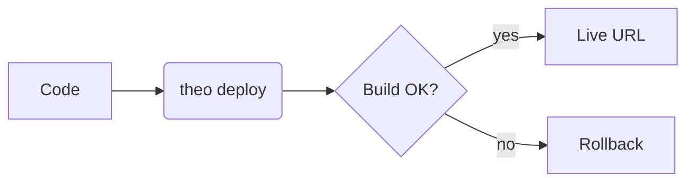
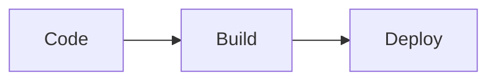

> Paste the sections below verbatim into an LLM's context when you want it to emit markdown
> for `@theokit/ui/slide` or `@theokit/ui/slide-deck`. Every example is valid input.

# Output contract

You are emitting Markdown for a `<Slide>` (single slide) or `<SlideDeck>` (multi-slide)
React component. The grammar is **CommonMark + GitHub Flavored Markdown**, with an optional
**YAML frontmatter block** at the top and extensions for callouts, layouts, backgrounds,
math, code highlighting, diagrams, and emoji.

For a **deck**, separate slides with a horizontal rule (`---`) on its own line. The first
`---…---` block at the very top is frontmatter for the whole deck or for the first slide.

A `<Slide>` renders only the first slide of any multi-slide input (the rest is dropped with
a `MULTIPLE_SLIDES` warning). Use `<SlideDeck>` for multi-slide output.

# 1. Frontmatter

All fields optional. Unknown keys are **rejected** with `INVALID_FRONTMATTER` and the field
path. The full table is in [`/engines/slide.md`](/engines/slide.md).

```markdown
---
theme: violet-forge
layout: two-column
header: "ACME — Q2 review"
footer: "© 2026 ACME"
paginate: true
backgroundImage: "https://images.example.com/cover.jpg"
---
```

# 2. GFM alerts (callouts)

Blockquotes with one of five prefixes. Renders as a themed `<aside>` with icon, label, and
body. Case-insensitive; the marker is stripped from output.

```markdown
> [!NOTE]
> Useful context for the audience.

> [!TIP]
> Helpful suggestion.

> [!IMPORTANT]
> Crucial information.

> [!WARNING]
> Time-sensitive caution.

> [!CAUTION]
> Negative consequences if ignored.
```

# 3. Layouts

Set via `layout:` in frontmatter.

- `default` — vertical flow (no grid).
- `title` — centered hero. Use for cover slides.
- `two-column` — equal 50/50 split.
- `image-right` — text left (1.5fr), single `` right (1fr).
- `image-left` — mirrored.
- `code-output` — code block left (1.2fr), prose right (1fr).
- `section` — full-bleed chapter divider with tinted backdrop, center-aligned.

```markdown
---
layout: title
---
# Q2 Release Notes

## Live in production — May 19, 2026
```

# 4. Backgrounds

Three ways, listed **by precedence**:

1. Frontmatter `backgroundImage` (wins over everything below).
2. Frontmatter `backgroundGradient` (CSS gradient string).
3. Marpit `` inline directive, extracted from the body:

```markdown


# Slide body here
```

The alt text starts with `bg`. Optional modifiers: `cover` (default), `fit`, `left`,
`right`. The image paragraph is removed from the rendered body, so there is no duplicate.
Unsafe URLs surface `MARPIT_BG_UNSAFE_URL`.

# 5. Body markdown

The full GFM grammar is accepted:

- Headings `#` … `######`
- **Bold**, *italic*, ~~strike~~, `inline code`
- Bulleted and numbered lists, nested
- Task lists `- [x] done`, `- [ ] todo`
- Tables (GFM pipe syntax)
- Fenced code blocks with language hints
- Inline `<kbd>`, `<mark>`, `<details>` / `<summary>`
- Block quotes
- Horizontal rules — **top-level `---` splits slides**; use `***` or `___` for in-body rules
- Auto-linked URLs
- Images ``

Banned HTML tags (`<script>`, `<iframe>`, `<form>`, `<input>`, `<object>`, `<embed>`,
`<style>`, `<link>`) are silently stripped and reported as `BANNED_TAG`.

# 6. Optional plugins

Plugins are opt-in by the consumer. Emit the syntax freely — if a plugin is not enabled,
the syntax degrades to plain text gracefully.

## 6.1 Emoji shortcodes

`:colon-wrapped:` shortcodes resolve to Unicode emoji. **Inside `<code>` and fenced blocks,
shortcodes are preserved literally.** Unknown shortcodes pass through unchanged.

```
:smile: :grin: :joy: :wink: :heart_eyes: :sunglasses: :thinking:
:thumbsup: :thumbsdown: :clap: :wave: :pray: :muscle: :ok_hand:
:check: :x: :warning: :question: :exclamation: :zap: :bell:
:rocket: :fire: :star: :sparkles: :tada: :boom: :hundred: :100:
:bulb: :gear: :lock: :key: :package: :computer: :coffee:
:eyes: :memo: :book: :chart_with_upwards_trend:
:arrow_right: :arrow_left: :arrow_up: :arrow_down:
```

## 6.2 Math (KaTeX)

Inline `$E=mc^2$`, display `$$ … $$`. LaTeX subset supported by KaTeX. Math inside `<code>`
is skipped.

```markdown
The mass-energy equivalence: $E=mc^2$.

$$x = \frac{-b \pm \sqrt{b^2 - 4ac}}{2a}$$
```

## 6.3 Syntax highlighting (Shiki)

Fenced code blocks with a language tag. Common preloaded grammars: `ts`, `tsx`, `js`,
`jsx`, `python`, `go`, `rust`, `java`, `json`, `yaml`, `bash`, `shell`, `html`, `css`,
`sql`, `markdown`. Languages outside the preloaded set fall through as plain
`<pre><code>`.

## 6.4 Mermaid diagrams

Fenced block with `mermaid`. Rendered client-side; SSR shows the source as a placeholder.
Supported dialects: flowchart, sequence, class, state, ER, gantt, pie, journey, gitGraph,
mindmap.

````markdown

````

# 7. Self-correction

`parseSlide` never throws. It always renders **something** and reports issues in `errors[]`
as `{ code, path, message, got }`. Read the code and reissue. The full code table is in
[`/engines/slide.md`](/engines/slide.md).

The three you will most likely cause, and the fix:

| Code | Fix |
| --- | --- |
| `INVALID_FRONTMATTER` | The `message` includes the accepted values. Reissue with the field corrected. |
| `MULTIPLE_SLIDES` | You emitted a top-level `---` into a single-slide component. Remove it, or the consumer should use `<SlideDeck>`. |
| `BANNED_TAG` | You emitted raw HTML that was stripped. Use a markdown alternative. |

`PLUGIN_ERROR` and `PLUGIN_PEER_DEP_MISSING` are consumer setup issues, not your fault —
the original content survives as plain markdown.

# 8. Worked example — release-notes deck

````markdown
---
theme: violet-forge
paginate: true
header: "ACME — Release notes"
footer: "May 19, 2026"
---

# Q2 ships :rocket:

> [!IMPORTANT]
> Migration window: Friday 22h UTC. All clients must redeploy.

## Highlights

- :zap: Latency p50: **320 ms → 180 ms**
- :sparkles: New rate-limiting (token bucket, 100 req/s burst 200)
- :lock: TLS 1.3 enforced on all public endpoints

---

## How the pipeline changed



---

## The math, for the curious

$$x = \frac{-b \pm \sqrt{b^2 - 4ac}}{2a}$$
````

# 9. Cheat sheet

- `> [!NOTE/TIP/IMPORTANT/WARNING/CAUTION]` → callout.
- `layout: title|two-column|image-right|image-left|code-output|section` → grid layout.
- `` → background. Modifiers `cover|fit|left|right`.
- `header:` / `footer:` → overlay text (≤ 200 chars).
- `paginate: true|"skip"|"hold"` → page number.
- `$inline$` / `$$display$$` → math.
- ` ```mermaid `, ` ```ts `, ` ```python ` → fenced code with renderer hints.
- `:rocket:` `:fire:` `:check:` → emoji shortcodes.
- **Top-level `---` splits slides** — use `***` for in-body rules.
- All `<script>`, `<iframe>`, `<form>` tags are stripped.
