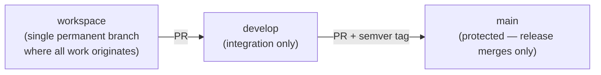

# Why this exists

The repository ships a required `quality:gates` CI workflow. A workflow that exists is not
the same as a workflow that **cannot be skipped**. Two layers guarantee different things,
and they are not interchangeable:

- The local hook guarantees the **origin** of the work — that it was authored on the
  working branch.
- **Branch protection on the remote** is what makes the PR and the passing check
  mandatory.

A repository without branch protection has the first guarantee and not the second.
**Local scripts cannot prevent an administrator from bypassing GitHub protections.** This
concept is the repository-side contract for what must be configured on GitHub.

# Required settings on the default branch

- [ ] Require a pull request before merging.
- [ ] Require approvals from Code Owners.
- [ ] Require status checks to pass before merging.
- [ ] Mark `quality:gates` as a **required** status check.
- [ ] Require branches to be up to date before merging.
- [ ] Do **not** allow bypassing the above settings.
- [ ] Restrict who can push directly to the protected branch.

# Branch flow

Work flows `workspace → develop → main`.

`develop` **integrates** work, it never originates it: it advances only through the
promotion PR from `workspace`. `main` receives only release merges from `develop`, each
carrying an annotated semver tag. The release record is at
[`/history/releases.md`](/history/releases.md).
